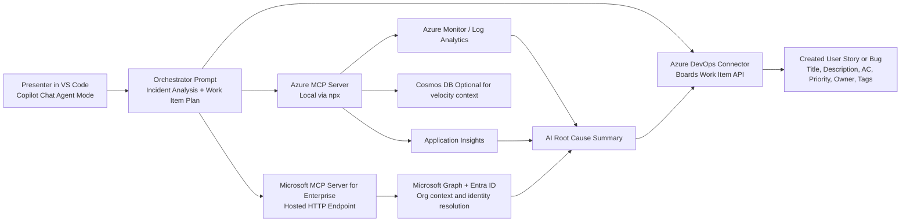

# One-Slide Architecture: VS Code AI Demo with Working Connectors

## Slide Title

AI in Action: Incident to Azure DevOps Story Flow in VS Code

## Single-Slide Architecture Visual



## Connector Contract for the Demo

1. VS Code Copilot Agent is the control plane.
2. Azure MCP Server provides runtime telemetry and platform context.
3. Enterprise MCP provides Microsoft Graph and Entra organizational context.
4. Azure DevOps connector creates and updates work items.
5. The AI output schema should be strict so ADO field mapping is deterministic.

## Output Schema for Reliable ADO Push

Use this JSON shape in your prompt so the create-work-item step is stable:

```json
{
  "workItemType": "User Story",
  "title": "string",
  "description": "string",
  "acceptanceCriteria": ["string"],
  "priority": 1,
  "severity": "string",
  "tags": ["ai-generated", "incident", "sre"],
  "areaPath": "string",
  "iterationPath": "string",
  "assignedTo": "user@contoso.com",
  "sourceIncident": {
    "service": "string",
    "incidentId": "string",
    "rootCause": "string",
    "evidence": ["string"]
  }
}
```

## VS Code Pre-Demo Smoke Test (All Connectors Green)

1. Open MCP status and confirm both servers are connected:
   - Azure MCP Server
   - Microsoft MCP Server for Enterprise
2. Confirm Azure auth in terminal:
   - Run az login
   - Run az account show
3. Validate Enterprise MCP tenant grant is already completed.
4. Validate ADO connectivity:
   - az devops configure --defaults organization=https://dev.azure.com/YOUR_ORG project=ContosoApp
   - az devops project show --project ContosoApp
5. In Copilot Agent mode, run these quick prompts:
   - List active critical alerts from Azure Monitor in my resource group.
   - Find a platform engineer from my tenant and return UPN.
   - Create a draft User Story in Azure DevOps from this incident summary.

## Demo Talk Track (60-90 seconds)

We start in VS Code where Copilot orchestrates across two official Microsoft MCP connectors. Azure MCP brings live telemetry and logs, Enterprise MCP resolves identity and org context, and the final agent step creates a structured Azure DevOps work item. The result is a repeatable flow from incident signal to execution-ready story with less manual triage and faster handoff to engineering.

## Success Criteria

1. Both MCP connectors are green in VS Code.
2. Alert and log query returns real data.
3. Graph identity lookup returns a valid user.
4. ADO story is created with required fields populated.
5. End-to-end flow completes in under 3 minutes.
