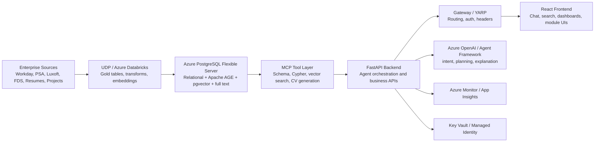
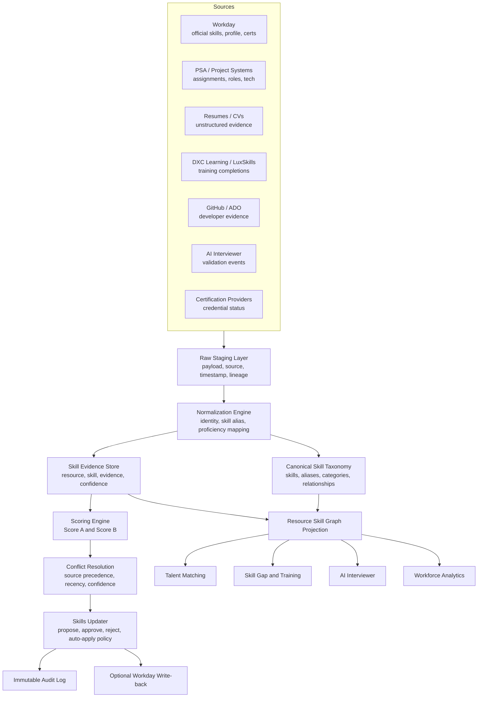
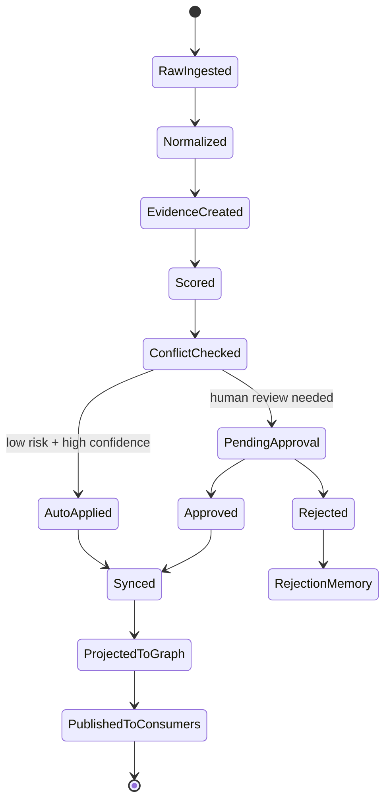

# Competency App Architecture and Build Guide

## Purpose

This README captures the design-level architecture for building the TalentIQ Competency app. It is intended to guide engineering, architecture reviews, implementation planning, and stakeholder discussions.

The Competency app should become the canonical Skills Intelligence Layer for TalentIQ. It should not be just a Workday skill-update screen. It should collect skill evidence, normalize it into a governed taxonomy, calculate confidence and completeness scores, generate auditable skill update proposals, and feed downstream TalentIQ modules such as talent matching, AI interviewer, training pathways, resource planning, and workforce analytics.

## Executive Summary

TalentIQ is an Azure-native, agentic talent intelligence platform. It combines enterprise data ingestion, a PostgreSQL-backed graph/vector/full-text intelligence store, MCP tools, FastAPI services, and a React frontend.

The Competency app fits into this platform as the governed layer for employee/resource skills:

```text
Source systems
-> ingestion and normalization
-> canonical skills library
-> skill evidence and scoring
-> governed update proposals
-> graph/vector/search projections
-> matching, gaps, training, AI interviewer, analytics
```

The most important design principle is:

```text
Workday is the official HR source of record.
TalentIQ Competency is the intelligence and enrichment layer.
```

Competency should not blindly overwrite Workday. It should create explainable proposals, route them through approval or policy rules, audit every change, and only then sync to Workday when allowed.

## Meeting and Stakeholder Context

Recent TalentIQ discussions with Vikay and the broader DXC/Microsoft team point to these architecture needs:

| Theme | Implication for Competency app |
|---|---|
| DXC environment access, AVD, Claude Code, DEV/ITG access | The app must run inside DXC-controlled environments with clear access, identity, repo, and infrastructure boundaries. |
| TalentX repo and module alignment | Competency should follow shared TalentIQ platform patterns, not become a disconnected standalone app. |
| Module teams asking why this architecture | Provide a clear technical story for PostgreSQL, graph, vector search, Databricks, FastAPI, React, and gateway choices. |
| Need for high-level architecture diagrams | Architecture artifacts must be understandable by Talent module teams, not just database engineers. |
| Skills module and agentic search alignment | Competency should feed the agentic TalentIQ search and matching experience with trusted skill data. |
| Security/infrastructure pushback expected | Access needs, RBAC, private networking, audit, privacy, and deployment assumptions must be documented early. |

## TalentIQ Platform Architecture

TalentIQ has five major layers:

1. Source systems
2. Data ingestion and transformation
3. Unified intelligence store
4. Backend and agent orchestration
5. Frontend and module UX



### TalentIQ Query Paths

TalentIQ should route each user question to the right retrieval path:

| User need | Retrieval path |
|---|---|
| Multi-skill search | Apache AGE / Cypher graph traversal |
| Similar employee, resume, or request | pgvector / DiskANN semantic search |
| Fuzzy keyword or certification lookup | PostgreSQL full-text and trigram search |
| Dashboards and counts | SQL or Cypher aggregation |
| CV/RFP matching | Document extraction, vector search, graph enrichment |

### Why PostgreSQL + AGE + pgvector

| Component | Purpose |
|---|---|
| Azure PostgreSQL Flexible Server | Single governed data boundary for relational, graph, vector, full-text, lookup, and audit data. |
| Apache AGE | Cypher graph traversal without operating a separate Neo4j server. |
| pgvector / DiskANN | Semantic similarity search for matching and recommendations. |
| Full-text / pg_trgm | Keyword, fuzzy name, certification, and resume/CV search. |
| Relational tables | Durable source of truth, constraints, migrations, audit, approval workflow. |

Important design rule:

```text
Relational PostgreSQL tables are the durable source of truth.
Apache AGE graph is a rebuildable projection/query layer.
```

Do not make the graph the only source of truth.

## Competency App Target Role

The Competency app should own:

- Canonical skills taxonomy
- Skill aliases and normalization
- Resource skill assertions
- Evidence and provenance
- Skill confidence scoring
- Profile completeness scoring
- Conflict resolution
- Skill update proposals
- Approval/rejection workflow
- Audit trail
- Graph/vector/search projections
- Downstream skill contracts for matching, gaps, training, and AI interviewer

It should not own:

- Official HR identity as source of record
- Workday master data ownership
- Uncontrolled direct overwrites to Workday
- Module-specific duplicate skill models in other TalentIQ modules

## Competency App Architecture



## Canonical Domain Model

Use a canonical enterprise model. Avoid flat skill strings.

### Core Entities

| Entity | Purpose |
|---|---|
| Resource | Canonical person entity for employee, contractor, candidate, or worker. |
| Skill | Canonical skill record. |
| SkillAlias | Maps raw names and synonyms to canonical skills. |
| SkillCategory | Hierarchical grouping of skills. |
| SkillRelationship | Related, prerequisite, alternative, specialization, parent-child relationships. |
| ResourceSkillAssertion | A claim that a resource has a skill at a level with evidence. |
| SkillEvidence | Source-backed evidence for a skill assertion. |
| ValidationEvent | AI interview, cert validation, test, peer review, manager validation. |
| Certification | Credential, issuer, expiry, mapped skills. |
| CompetencyProposal | Proposed add/update/remove skill change. |
| ProfileCompletenessScore | Employee-level skill profile health score. |
| TrainingPathway | Recommended training to close a gap. |
| AuditEvent | Immutable record of manual and automated changes. |

### Recommended Relationship Model

Do not model validation as `Employee+Skill -> ValidationEvent` directly. Use an explicit assertion node/entity:

```text
Resource
  -> ResourceSkillAssertion
      -> Skill
      -> SkillEvidence
      -> ValidationEvent
      -> Certification
```

This makes provenance, scoring, validation, conflict handling, and audit much cleaner.

### Matching-Ready Skill Fields

Each skill assertion should support matching and explainability:

| Field | Purpose |
|---|---|
| resource_id | Link to canonical person. |
| skill_id | Link to canonical skill. |
| canonical_name | Display and search. |
| aliases | Normalize raw source values. |
| category | Browse and filter. |
| domain | Domain-level matching. |
| proficiency_level | Normalized 1-5 scale. |
| years_experience | Seniority signal. |
| last_used_date | Recency and stale detection. |
| source_system | Provenance. |
| confidence_score | Trust level. |
| validation_status | Self-reported, inferred, validated, disputed, stale. |
| certification_link | Credential evidence. |
| evidence_summary | Explainability for UI and APIs. |
| stale_flag | Refresh and notification trigger. |

## Source Systems and Authority

### Source Roles

| Source | Role |
|---|---|
| Workday | Official HR profile, official skills, official certifications. |
| PSA / Project systems | Applied skills from project assignments and roles. |
| Resumes / CVs | Unstructured evidence; useful but must be parsed and validated. |
| DXC Learning / LuxSkills | Training progress and completion signals. |
| GitHub / ADO | Developer observability and recent hands-on evidence. |
| AI Interviewer | Skill validation and assessment outcomes. |
| Certification providers | Credential status and expiry. |

### Source Precedence

Use this default precedence:

1. Validated evidence wins: AI Interviewer, certifications, proctored assessments, manager validation.
2. Workday wins for official HR profile and official certification fields.
3. Recent project evidence wins for applied experience.
4. Resumes/CVs are supporting evidence unless corroborated.
5. Self-reported skills require evidence or approval before influencing high-stakes matching.

## Ingestion and Normalization Flow

```text
Extract
-> stage raw payload
-> normalize person identity
-> normalize skill aliases
-> normalize proficiency scale
-> create evidence records
-> calculate confidence/completeness
-> resolve conflicts
-> generate proposals
-> approve/reject/auto-apply
-> update relational store
-> rebuild graph/vector/full-text projections
-> publish downstream events
-> write immutable audit
```

### Ingestion Requirements

- Every source payload must retain source, timestamp, correlation ID, and raw reference.
- Writes should be idempotent.
- Staging tables should support replay.
- Unknown skills should route to taxonomy review.
- Conflicts should route to approval queue.
- Low-confidence AI extraction should not auto-apply.

## Scoring Design

The scoring engine should be deterministic first. LLMs can explain or recommend, but should not invent the numeric confidence score.

### Score A: Skill Confidence

Question:

```text
How sure are we this skill belongs on this resource profile?
```

| Signal | Weight | Example |
|---|---:|---|
| Workday + PSA assignment | 30 | Skill appears in Workday and recent project assignment. |
| Developer observability | 20 | GitHub, ADO, SABA/DXC Learning signals. |
| AI Interviewer / new hire assessment | 15 | Interview validates a technical skill. |
| Active certification | 15 | AWS credential maps to AWS skills. |
| CV/resume mention | 10 | Recent CV mentions the skill. |
| Role taxonomy / job profile | 10 | Role specialization includes the skill. |

Recommended formula:

```text
Score A =
  weighted source signals
  * recency decay
  + multi-source confirmation bonus
  - stale penalty
  - conflict penalty
```

Recency decay:

| Last used | Multiplier |
|---|---:|
| <= 6 months | 1.0 |
| 6-12 months | 0.7 |
| 12-24 months | 0.4 |
| > 24 months | 0.2 or stale |

### Score B: Profile Completeness

Question:

```text
How complete and current is this resource's skill profile?
```

| Signal | Points |
|---|---:|
| Workday skills populated | 40 |
| Certifications | 20 |
| CV attached and refreshed | 15 |
| AI Interview / new hire assessment | 10 |
| Developer / learning freshness | 10 |
| Peer or performance validation | 5 |

Thresholds:

| Score | Status |
|---:|---|
| < 40 | Needs Work |
| 40-70 | Healthy |
| 70+ | Strong |

## Skills Updater Workflow

The Skills Updater is the governed update engine.



### Proposal Metadata

Each proposal should include:

| Field | Purpose |
|---|---|
| proposal_id | Unique proposal ID. |
| resource_id | Target resource. |
| skill_id | Target skill. |
| old_value | Current value. |
| proposed_value | Suggested new value. |
| confidence_score | Deterministic confidence. |
| evidence_refs | Supporting evidence IDs. |
| reason | Human-readable explanation. |
| approval_status | Draft, pending, approved, rejected, applied, reverted. |
| approver | Human or policy actor. |
| sync_status | Workday/LuxSkills sync status if applicable. |
| created_at / updated_at | Lifecycle timestamps. |

### Example Proposal

```text
Resource: Arjun Kapoor
Skill: Azure Synapse
Current: Proficient, last used 2024-08
Proposed: Expert, last used 2026-04
Confidence: 96
Evidence: Mercer project, PSA role, ADO work items, recent usage
Action: Approve / Reject / Request review
```

## Conflict Resolution

When multiple sources disagree:

1. Apply source precedence.
2. Apply recency rule.
3. Apply confidence threshold.
4. Compare validation status.
5. Route unresolved conflicts to approval queue.
6. Persist the decision and rationale in audit.

Example:

```text
Workday says Python level 2.
PSA says recent Python project delivery.
AI Interviewer validates Python level 4.

Result:
Create proposal to update Python to level 4 with validation evidence.
Do not silently overwrite Workday unless policy allows it.
```

## Graph, Vector, Full-Text, and Relational Projections

### Storage Strategy

```text
Relational tables = source of truth
Apache AGE graph = traversal projection
pgvector = semantic similarity projection
Full-text indexes = lexical/fuzzy search projection
Audit tables = immutable compliance record
```

### Graph Nodes

- Resource
- Skill
- SkillCategory
- Certification
- ValidationEvent
- SkillEvidence
- Project
- Role
- TrainingPathway

### Graph Edges

| Edge | Meaning |
|---|---|
| HAS_SKILL | Resource has Skill. |
| HAS_ASSERTION | Resource has ResourceSkillAssertion. |
| ASSERTS_SKILL | Assertion points to Skill. |
| EVIDENCED_BY | Assertion supported by SkillEvidence. |
| VALIDATED_BY | Assertion validated by ValidationEvent. |
| HOLDS | Resource holds Certification. |
| REQUIRES | Certification or role requires Skill. |
| BELONGS_TO | Skill belongs to SkillCategory. |
| RELATED_TO | Skill related to Skill. |
| PREREQUISITE_FOR | Skill is prerequisite for another Skill. |
| TRAINED_BY | Skill gap addressed by TrainingPathway. |

### AGE Feasibility Gate

Before build, validate:

- Azure PostgreSQL version
- Apache AGE availability in exact SKU, region, and version
- Extension install permissions
- Backup/restore behavior
- Query performance for expected graph sizes
- Fallback if AGE is unavailable

Fallback:

```text
PostgreSQL relational tables
+ pgvector
+ recursive CTEs
+ materialized relationship tables
```

## API Design

Use versioned APIs from day one.

### Catalog APIs

| Method | Endpoint | Purpose |
|---|---|---|
| GET | /api/v1/skills | Search and browse canonical skills. |
| GET | /api/v1/skills/{skillId} | Get skill details. |
| GET | /api/v1/skills/categories | Get taxonomy tree. |
| GET | /api/v1/skills/aliases | Search aliases and raw mappings. |
| POST | /api/v1/skills | Create skill, admin only. |
| PUT | /api/v1/skills/{skillId} | Update skill, admin only. |

### Resource Skill APIs

| Method | Endpoint | Purpose |
|---|---|---|
| GET | /api/v1/resources/{resourceId}/skills | Get resource skill profile. |
| PUT | /api/v1/resources/{resourceId}/skills/{skillId} | Manual skill update. |
| GET | /api/v1/resources/{resourceId}/skill-gaps | Gap analysis for target role or request. |
| GET | /api/v1/resources/{resourceId}/profile-completeness | Score B profile health. |

### Matching APIs

| Method | Endpoint | Purpose |
|---|---|---|
| POST | /api/v1/skills/match | Match resources against required skills. |
| POST | /api/v1/skills/similar | Find related/adjacent skills. |
| POST | /api/v1/resources/match-request | Match resources to a resource request. |

### Updater APIs

| Method | Endpoint | Purpose |
|---|---|---|
| POST | /api/v1/skills/updater/proposals | Create proposal. |
| GET | /api/v1/skills/updater/proposals | List proposals. |
| PUT | /api/v1/skills/updater/proposals/{id}/approve | Approve proposal. |
| PUT | /api/v1/skills/updater/proposals/{id}/reject | Reject proposal. |
| PUT | /api/v1/skills/updater/proposals/{id}/revert | Revert applied proposal. |

### Validation APIs

| Method | Endpoint | Purpose |
|---|---|---|
| POST | /api/v1/skills/validations | Receive validation event. |
| GET | /api/v1/resources/{resourceId}/validations | View resource validations. |
| GET | /api/v1/skills/{skillId}/validations | View validation activity for skill. |

### Write API Requirements

All write endpoints should include:

- Idempotency key
- Actor identity
- Source system
- Correlation ID
- Request timestamp
- Audit event creation
- Standard error contract
- Authorization scope checks

## Matching Integration Contract

Competency should provide normalized scoring features to Talent Matching.

```text
direct_skill_match_score
semantic_skill_match_score
proficiency_score
recency_score
certification_score
validation_score
adjacency_score
availability_score
stale_penalty
confidence_score
```

Explainability payload:

```text
matched_required_skills
matched_related_skills
missing_skills
proficiency_fit
recency_impact
validation_evidence
certification_evidence
training_needed
confidence_indicators
source_breakdown
```

## Skill Gap and Training Contract

Gap object:

```text
required_skill
current_skill_level
required_level
gap_severity
evidence
recommended_training
estimated_time_to_ready
reassessment_required
status
```

Gap lifecycle:

```text
Identified
-> Assessed
-> GapAnalyzed
-> InTraining
-> Reassessing
-> Ready
-> Assigned
```

## UI Design

### Required Screens

| Screen | Primary user | Purpose |
|---|---|---|
| Skills Library | Admin / analyst | Browse taxonomy, aliases, categories, relationships. |
| Resource Skills Profile | Employee / manager | View current skills, evidence, confidence, freshness. |
| Skills Updater Queue | Approver / admin | Approve, reject, revert proposed changes. |
| Gap Dashboard | Manager / staffing / training | Compare resource skills against target role/request. |
| Matching Explainability | Staffing / recruiter | Explain why a resource matched or missed. |
| Training Pathway | Employee / manager | Show learning recommendations and readiness path. |
| Admin Console | Skills admin | Manage weights, taxonomy, source policy, suppression rules. |

### UX Principles

- One primary action per screen.
- Evidence before approval.
- Progressive disclosure for dense technical detail.
- Consistent tier, score, and color semantics.
- Role-aware layouts and actions.
- Every score must be explainable.
- Every failure must be actionable.
- Support empty, stale, conflict, pending, success, failure, and permission-denied states.

### Minimum States

- Loading
- Empty profile
- No signal available
- Stale profile
- Source conflict
- Approval pending
- Write-back success
- Write-back failed
- Suppressed notification
- Permission denied

## Security and Compliance

### RBAC Roles

| Role | Capabilities |
|---|---|
| SkillsViewer | View allowed skill profiles and taxonomy. |
| SkillsEditor | Edit skills where permitted. |
| SkillsApprover | Approve/reject proposed updates. |
| SkillsAdmin | Manage taxonomy, weights, policy, source mappings. |
| ResourceManager | View/manage team skills and gaps. |
| ChapterGuildLead | View domain-level skills, gaps, and learning readiness. |

### Controls

- Microsoft Entra ID authentication.
- Group-based authorization.
- Field-level access controls for sensitive HR attributes.
- Private endpoints for PostgreSQL.
- VNet integration.
- Managed identity to database where possible.
- Key Vault for secrets.
- Encryption in transit and at rest.
- Data residency aligned to DXC policy.
- Immutable audit log.
- Retention policy.
- Data minimization.

## Audit Requirements

Every skill change should write an audit record with:

| Field | Purpose |
|---|---|
| audit_id | Unique event ID. |
| resource_id | Target resource. |
| skill_id | Target skill. |
| changed_by | User or service principal. |
| changed_at | Timestamp. |
| source_system | Origin of change. |
| old_value | Previous value. |
| new_value | New value. |
| confidence_score | Score at decision time. |
| evidence_ids | Supporting evidence. |
| approval_status | Approval state. |
| approver | Human/policy approver. |
| sync_status | Downstream sync result. |
| correlation_id | End-to-end trace ID. |

## Observability

### Metrics

| Metric | Purpose |
|---|---|
| ingestion_success_rate | Pipeline health. |
| ingestion_lag_minutes | Data freshness. |
| normalization_conflict_rate | Taxonomy/source quality. |
| unknown_skill_rate | Taxonomy coverage. |
| proposal_auto_apply_rate | Governance policy behavior. |
| approval_cycle_time | Operational efficiency. |
| match_api_p95_ms | Matching performance. |
| profile_freshness_days | Profile currency. |
| score_a_distribution | Skill confidence health. |
| score_b_distribution | Profile completeness health. |
| audit_write_failures | Compliance risk. |
| workday_sync_failures | Integration health. |

### Initial SLOs to Validate

| Area | Target |
|---|---|
| Match API p95 | < 400 ms for MVP workloads. |
| Daily ingestion freshness | < 24 hours. |
| Proposal processing success | > 99%. |
| Audit writes | 100% required for write success. |

## MVP Scope

The MVP should be Workday-first and governance-first.

### In Scope

| Area | Deliverable |
|---|---|
| Canonical skill catalog | Skill, alias, category, basic relationships. |
| Resource skill profile | Current skills, proficiency, source, freshness, confidence. |
| Workday ingestion | Daily batch into staging, normalize, upsert. |
| Evidence model | Source, timestamp, confidence, provenance. |
| Score A baseline | Deterministic confidence using available signals. |
| Score B baseline | Profile completeness and stale profile detection. |
| Skills Updater | Proposal queue with approve/reject. |
| Matching API | Exact skill matching with explainability. |
| Basic UI | Skill library, resource profile, proposal queue, simple gap view. |
| Audit and RBAC | Mandatory from MVP. |

### Deferred

- Resume NLP extraction.
- Full AI Interviewer feedback loop.
- GitHub/ADO developer observability.
- Advanced graph visualization.
- Broad auto-apply policy.
- Certification expiry automation.
- Learning-path optimization.
- Advanced related-skill inference.

## Phase 0 Architecture Decisions

Close these decisions before build starts:

| Decision | Recommended position |
|---|---|
| Canonical person entity | Use Resource; map Employee/Candidate/Contractor variants through adapters. |
| Source of record | Workday for official data; TalentIQ for enrichment. |
| Graph source of truth | No; graph is rebuildable projection. |
| AGE feasibility | Validate exact Azure PostgreSQL SKU/region/version; define fallback. |
| Taxonomy ownership | DXC-owned canonical taxonomy with stewardship. |
| Proficiency model | Normalize to 1-5 plus confidence and evidence. |
| Update governance | Proposal and approval workflow first. |
| Workday write-back | API-mediated, audited, policy-controlled. |
| Privacy/RBAC | Sign off before employee skill ingestion. |
| MVP scope | Workday-first catalog/profile/matching/updater/audit. |

## Implementation Plan

### Phase 0: Architecture Validation

1. Confirm AGE support in target Azure PostgreSQL.
2. Define fallback if AGE is unsupported.
3. Lock canonical domain names.
4. Approve source precedence policy.
5. Approve taxonomy stewardship model.
6. Approve security, privacy, RBAC, and audit baseline.
7. Confirm Workday fields and access.

Exit criteria:

- Signed decision register.
- Approved logical data model.
- Approved MVP scope.
- Confirmed environment access.

### Phase 1: Data Foundation

1. Create relational schema and migrations.
2. Create canonical skill, alias, category, relationship tables.
3. Create resource skill assertion and evidence tables.
4. Create validation event and certification tables.
5. Create proposal and audit tables.
6. Build Workday-first ingestion into staging.
7. Add normalization and dedupe.
8. Add source provenance and freshness timestamps.

Exit criteria:

- Sample Workday payload loads idempotently.
- Skill profiles are queryable.
- Audit is written for every change.

### Phase 2: Intelligence Layer

1. Implement Score A.
2. Implement Score B.
3. Add conflict resolution.
4. Add Skills Updater proposals.
5. Add approval/rejection/revert flow.
6. Add matching features and explainability.
7. Add basic skill gap output.
8. Build graph/vector/full-text projections.

Exit criteria:

- Proposal workflow works end to end.
- Matching API returns explainable results.
- Graph/vector projection can be rebuilt.

### Phase 3: Productization

1. Add versioned APIs.
2. Add gateway routes.
3. Add RBAC scopes.
4. Build UI screens.
5. Add App Insights dashboards.
6. Add operational runbooks.
7. Add integration and contract tests.
8. Run DEV smoke test.

Exit criteria:

- End-to-end flow works:

```text
ingest -> normalize -> score -> propose -> approve -> audit -> project -> match/gap
```

## Repo and Deployment Guidance

If building as multiple components, keep runtime boundaries clean:

| Component | Suggested runtime |
|---|---|
| competency-backend | FastAPI / Azure Container Apps |
| competency-ui | React / Azure Container Apps or Static Web App |
| competency-workflow | Databricks workflows / PySpark |
| competency-contracts | Shared JSON Schema / Pydantic / generated TypeScript |
| taxonomy-service | Optional if taxonomy governance grows large |

Recommended approach:

```text
Keep backend, UI, and workflow deployable independently.
Create shared contracts to avoid schema drift.
Use versioned APIs and contract tests.
Avoid direct workflow writes to final app tables unless explicitly governed.
```

## Environment Checklist

| Item | Owner |
|---|---|
| Azure PostgreSQL access and extension permissions | Platform / DevOps |
| AGE feasibility validation | Platform / Architecture |
| Databricks workspace and jobs | Data Engineering |
| Workday API or export access | DXC HR IT / Workday Admin |
| Key Vault secrets | DevOps |
| Entra app registrations and groups | IAM |
| Gateway routes | Backend / Platform |
| App Insights dashboards | DevOps / Engineering |
| DEV smoke-test data | Product / Data Engineering |

## Build Backlog

### P0

- Canonical data model.
- Workday-first ingestion.
- Skill taxonomy and aliases.
- Resource skill profile API.
- Evidence and provenance.
- Immutable audit.
- RBAC baseline.

### P1

- Score A confidence engine.
- Score B completeness engine.
- Proposal approval workflow.
- Matching API with explainability.
- Basic competency UI.
- Conflict resolution.

### P2

- Graph projection.
- pgvector semantic skill matching.
- Skill gap dashboard.
- Training pathway contract.
- Notification and stale-profile reminders.

### P3

- Resume extraction.
- AI Interviewer feedback loop.
- GitHub/ADO developer observability.
- Certification provider integrations.
- Advanced graph visualization.
- Auto-apply policy tuning.

## Open Questions

1. Is Competency for employees only, candidates only, contractors, or all resource types?
2. Who owns the canonical skill taxonomy?
3. Which Workday fields are available and approved for ingestion?
4. Is Apache AGE approved in the target Azure PostgreSQL environment?
5. What is the fallback if AGE is unavailable?
6. What profile fields can managers see?
7. What profile fields can staffing users see?
8. Should Workday write-back be included in MVP?
9. What confidence threshold allows auto-apply, if any?
10. Where are resumes/CVs stored?
11. Which system owns performance or peer validation?
12. Which skill data is allowed for AI processing?
13. What is the target p95 for matching and profile APIs?
14. What is the retention policy for evidence and audit?

## Final Architecture Position

The Competency app should be built as the shared Skills Intelligence Layer for TalentIQ.

It should:

- Treat Workday as the official source of record.
- Use TalentIQ for enrichment, matching, evidence, scoring, proposals, and recommendations.
- Use relational PostgreSQL as the durable source of truth.
- Use Apache AGE as a graph projection for traversal.
- Use pgvector for semantic matching.
- Use deterministic scoring before LLM reasoning.
- Require explainability and audit for every skill change.
- Feed all downstream TalentIQ modules through versioned APIs and shared contracts.

The key stakeholder message:

```text
Skills is not just a profile feature.
It is the data foundation for matching, training, interview readiness,
workforce planning, and audit compliance.
The architecture must make skills trustworthy, explainable, current, and governed.
```
